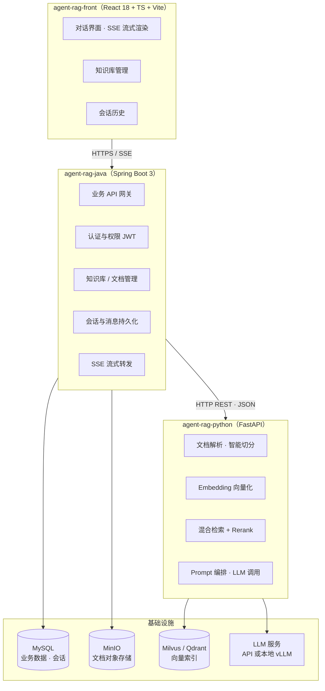

# 01 总体架构与技术选型

## 1. 设计目标

构建一个企业内部可用的知识库问答系统，核心诉求：

- **准确可溯源**：回答基于知识库内容生成，并给出引用出处，降低幻觉
- **流式体验**：逐 token 输出，首 token 延迟（TTFT）尽量低
- **工程稳定**：业务逻辑（用户、权限、会话）与 AI 逻辑解耦，各自独立迭代、独立扩缩容
- **可演进**：向量库、LLM、Embedding 模型均为可替换组件

## 2. 总体架构



### 三层职责边界（重要设计原则）

| 层 | 职责 | 不做什么 |
|---|---|---|
| **前端** | 交互渲染、SSE 接收、Markdown/引用展示、文件上传进度 | 不感知模型、不直连 Python |
| **Java 业务层** | 用户/权限、知识库与文档 CRUD、会话与消息落库、文件存取、SSE 透传、审计 | 不做任何向量/模型计算，不理解 chunk |
| **Python AI 层** | 解析、切分、Embedding、检索、Rerank、Prompt、调 LLM | 不碰用户体系，不存业务数据（无状态或弱状态） |

> 关键收益：AI 层可以随时重写/替换（比如从自研换成 Dify、LangChain 服务），Java 层无感；业务侧改需求（加审批、加审计）也不会牵动 AI 代码。

## 3. 技术选型明细

### 3.1 前端 agent-rag-front

| 项 | 推荐 | 备选 | 理由 |
|---|---|---|---|
| 框架 | React 18 + TypeScript + Vite | Vue 3 | 生态最大，AI 类组件参考实现多 |
| UI 组件库 | Ant Design 5 | shadcn/ui | 知识库后台表单/表格密集，AntD 效率最高 |
| 流式接收 | fetch + ReadableStream 手写 SSE 解析 | EventSource、@microsoft/fetch-event-source | EventSource 不支持 POST 与自定义 Header，手写解析最灵活 |
| Markdown | react-markdown + remark-gfm + rehype-highlight | markdown-it | 边收边渲染，支持表格与代码高亮 |
| 状态管理 | Zustand | Redux Toolkit | 轻量，会话/流式状态足够 |
| 文件上传 | AntD Upload（分片可选） | tus-js-client | 大文件建议分片 + 断点续传 |

### 3.2 Java 业务层 agent-rag-java

| 项 | 推荐 | 备选 | 理由 |
|---|---|---|---|
| 框架 | Spring Boot 3.3（JDK 17/21） | Quarkus | 团队熟悉度、生态 |
| ORM | MyBatis-Plus | JPA | 国内主流，分页/代码生成方便 |
| 认证 | Spring Security + JWT | Sa-Token、对接 SSO | 无状态，易水平扩展 |
| SSE 转发 | SseEmitter（MVC） | WebFlux + WebClient | MVC 模型简单；若全链路背压要求高再上 WebFlux |
| HTTP 客户端 | RestClient（Boot 3.2+）/ OpenFeign | OkHttp | 调 Python；流式接口用 WebClient 或 OkHttp |
| 业务库 | MySQL 8 | PostgreSQL | 见 04 文档 |
| 对象存储 | MinIO | 阿里云 OSS / S3 | SDK 兼容 S3 协议，可平滑切换云存储 |
| 异步任务 | 线程池 / @Async（一期） | RocketMQ / RabbitMQ（二期） | 文档解析任务先简单跑通，量上去再 MQ 化 |

### 3.3 Python AI 层 agent-rag-python

| 项 | 推荐 | 备选 | 理由 |
|---|---|---|---|
| Web 框架 | FastAPI + Uvicorn | Flask、gRPC server | 原生异步、Pydantic 校验、自动生成 OpenAPI 文档（Java 可据此生成客户端） |
| RAG 实现 | **自研薄封装** | LangChain、LlamaIndex | 检索→rerank→拼 prompt 核心仅数百行，自研可控、好调试；框架全家桶黑盒重、版本变动剧烈 |
| Embedding | **BGE-M3**（bge-m3） | text-embedding-3-large、m3e、GTE-Qwen2 | 中文第一梯队；单模型同时产出稠密+稀疏向量；8192 上下文 |
| Rerank | **bge-reranker-v2-m3** | bge-reranker-large、Cohere Rerank API | 与 BGE-M3 同族，中英混排效果好 |
| PDF 解析 | PyMuPDF（常规）+ **MinerU**（复杂版式/扫描件） | pdfplumber、unstructured、Docling | 见 02 文档第 2 节 |
| Word/其他 | python-docx、openpyxl、markdown-it | — | — |
| OCR | PaddleOCR | RapidOCR | 扫描件兜底 |
| LLM（云端） | DeepSeek-V3 / 通义千问 qwen-plus | GPT-4o、Kimi | 国内合规、成本极低、OpenAI 兼容协议 |
| LLM（本地） | vLLM 部署 Qwen2.5-7B/14B-Instruct | Ollama（轻量场景） | vLLM 吞吐高，OpenAI 兼容接口 |
| 模型推理 | sentence-transformers / FlagEmbedding | TEI（HuggingFace） | 团队可控；量大可换 TEI |
| 观测 | Langfuse（可选，二期） | LangSmith | 检索/生成链路 trace |

### 3.4 向量库

| 场景 | 推荐 | 说明 |
|---|---|---|
| 起步 / POC | PGVector（PG 插件）或 Chroma | 零新增组件，最快验证闭环 |
| 生产 / 百万级 chunk | **Milvus 2.4+** | 功能最全（稠密+稀疏+标量过滤、分区键），社区成熟 |
| 生产 / 轻量替代 | Qdrant | Rust 实现，单机性能好，运维简单 |
| 已有 ES 运维体系 | Elasticsearch 8.x | 向量 + BM25 一体，混合检索一个库搞定 |

> 本方案默认 **Milvus**，并在代码层抽象 `VectorStore` 接口，保证可替换。

### 3.5 Java ↔ Python 通信方式对比

| 方案 | 延迟 | 实现复杂度 | 适用场景 | 结论 |
|---|---|---|---|---|
| **HTTP/REST + SSE** | 低（局域网 1~3ms） | 低 | 问答流式、检索、入库、管理接口 | **一期主力** |
| MQ 异步（RocketMQ/RabbitMQ） | — | 中 | 文档解析入库等长耗时任务 | 二期按量引入 |
| gRPC | 更低 | 中（proto 维护） | 内部高频 RPC | 暂不引入 |
| 进程内调用（JNI/Py4J） | 最低 | 高 | — | 禁止：部署运维灾难 |

**一期通信策略**：

- 同步问答：`POST /v1/chat/completions`，Python 侧 SSE 流出，Java 透传
- 文档入库：Java 提交任务（HTTP 同步接口 + Python 后台任务），Java 轮询状态或接收回调
- 全部内部接口走内网，加静态 Token（`X-Internal-Token`）防裸奔

## 4. 仓库结构建议

```
agent-rag-java
├── src/main/java/com/example/rag
│   ├── module/auth          # 登录、JWT、权限
│   ├── module/kb            # 知识库、文档管理、解析任务调度
│   ├── module/chat          # 会话、消息、SSE 转发
│   ├── infra/ai             # Python 服务客户端封装（AiClient）
│   └── infra/storage        # MinIO 封装

agent-rag-python
├── app/
│   ├── api/                 # FastAPI 路由（chat / ingest / kb / healthz）
│   ├── core/                # 配置、日志、依赖注入
│   ├── rag/
│   │   ├── parser/          # 各格式解析器（pdf / docx / md / xlsx）
│   │   ├── chunker/         # 切分策略
│   │   ├── embedder/        # BGE-M3 推理
│   │   ├── retriever/       # 稠密 + 稀疏混合检索
│   │   ├── reranker/        # bge-reranker 精排
│   │   ├── generator/       # Prompt 组装 + LLM 流式调用
│   │   └── store/           # VectorStore 抽象 + Milvus 实现
│   └── schemas/             # Pydantic 请求/响应模型（与 Java 契约对齐）
└── tests/

agent-rag-front
├── src/
│   ├── pages/chat/          # 对话页（流式渲染、引用面板）
│   ├── pages/kb/            # 知识库列表 / 文档管理 / 上传
│   ├── api/                 # 请求封装、SSE 客户端
│   └── stores/              # Zustand
```

## 5. 非功能性设计

| 维度 | 方案 |
|---|---|
| 可替换性 | LLM、Embedding、向量库均走接口抽象 + 配置切换 |
| 水平扩展 | Python 层无状态，多副本 + Nginx 负载；Embedding/Rerank 耗 GPU，独立副本组 |
| 配置管理 | Python 用 pydantic-settings（.env）；Java 用 application.yml + Nacos（可选） |
| 日志审计 | Java 落全量问答记录；Python 结构化日志（JSON）输出检索详情 |
| 安全 | 前端→Java：JWT；Java→Python：内网 + Internal Token；知识库级 ACL 在检索过滤层落实 |

## 6. 关键决策点（待定）

1. **LLM 来源**：云端 API（零运维、按 token 计费）vs 本地 vLLM（数据不出内网、需 GPU）
2. **规模**：文档总量 / chunk 总量 / 峰值 QPS → 向量库选型与副本规划
3. **权限**：知识库级隔离的粒度（仅按部门？还是用户自定义授权？）
